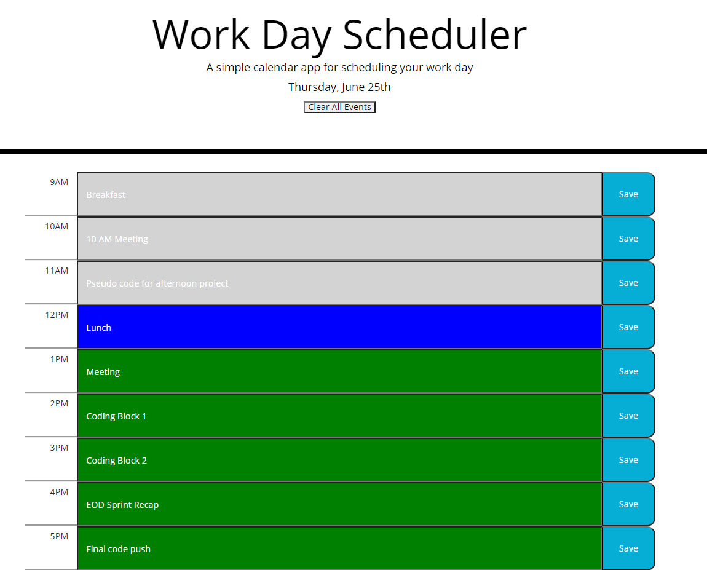

# Work Day Scheduler
This is a simple calendar application that allows the user to save events for each hour of the day. This app will run in the browser and feature dynamically updated HTML and CSS powered by jQuery and leverages the Moment.js library.


Deployed Application: https://pmulhern.github.io/Day-Planner/




## Aplication

```
Allows user to enter tasks for standard working hours 9AM to 5PM.
Tasks are stored to the Local Drive and retrieved from the same.
There is a button to clear all stored items as users may want to start fresh day over day.
The time slots change colors as the hours progress:
    Gray - Time of day has passed
    Blue - Represents the current hour
    Green - Represents future time periods
```


## Code

```
Majority of functional code is leveraging JavaScript and jQuery with special emphasis on each and for loops to cut down on repitive code.  

```


